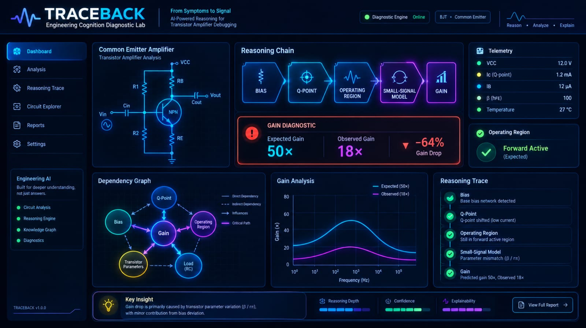
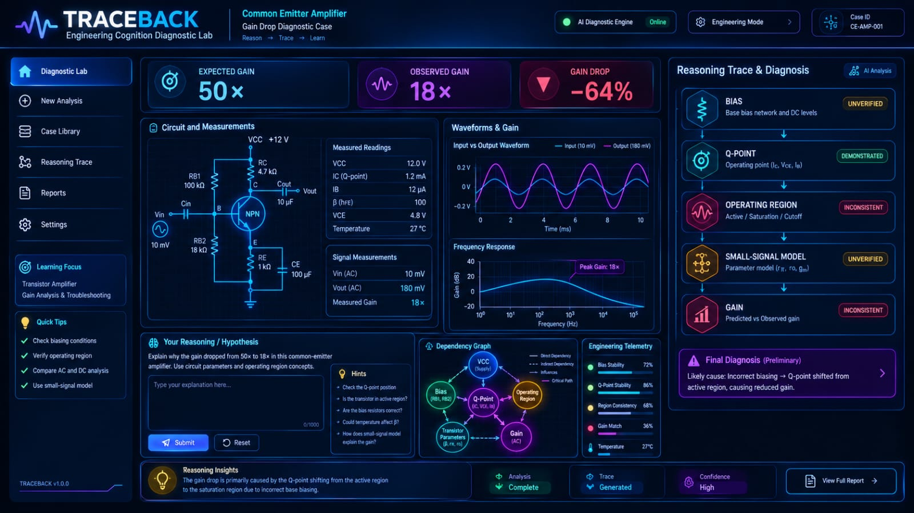
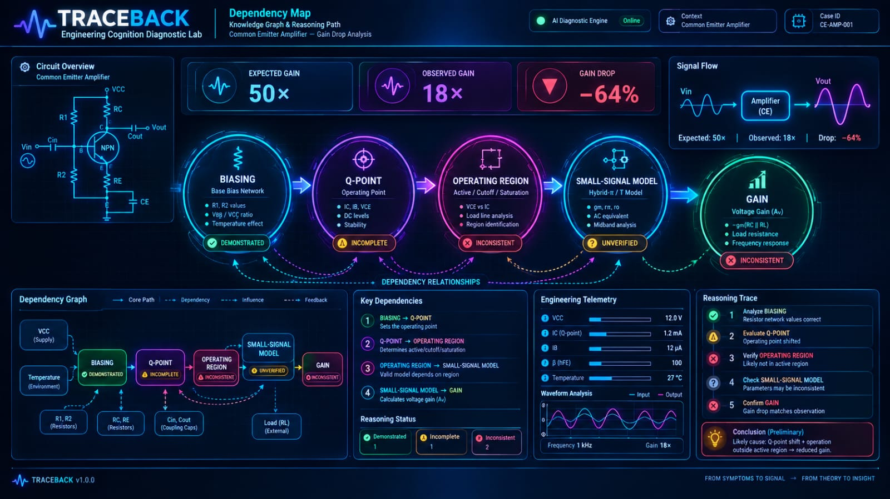
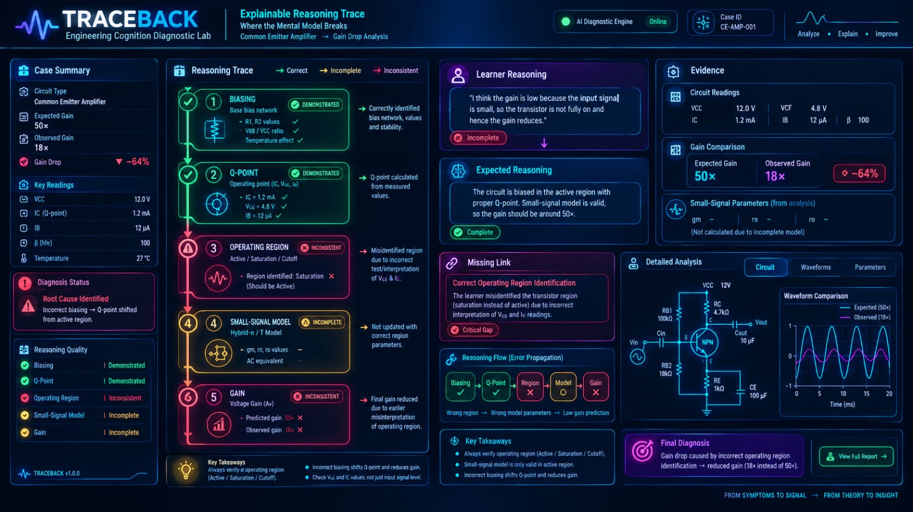
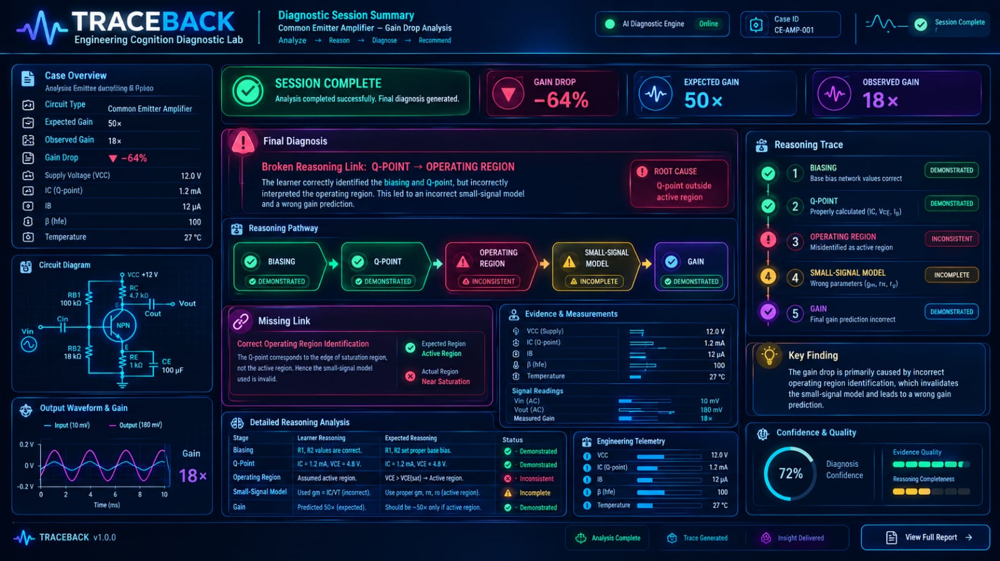
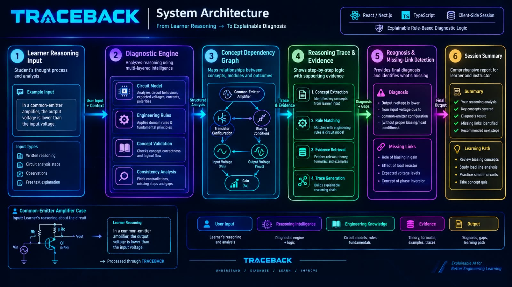
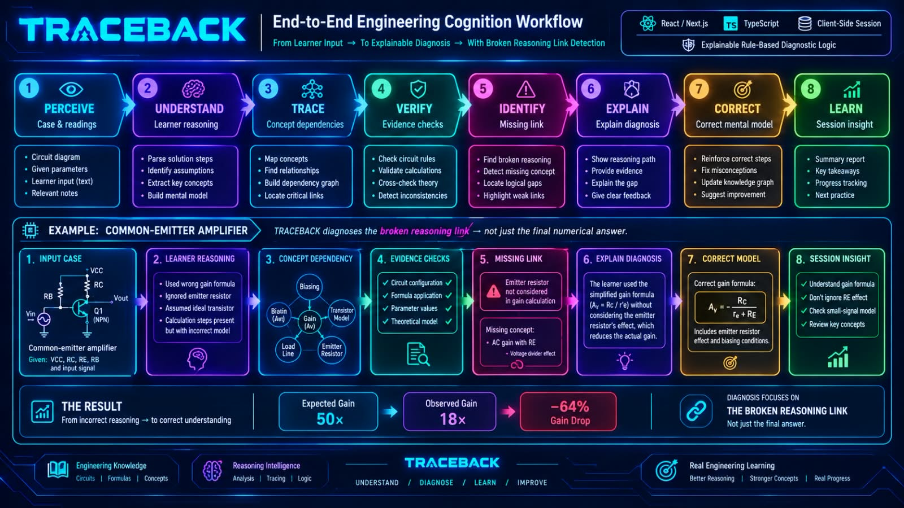

# TRACEBACK

TRACEBACK is a single-case engineering knowledge diagnostic for an undergraduate ECE transistor-amplifier gain-drop scenario. It maps a learner's free-text reasoning to an authored concept dependency chain, explains the evidence behind each status, and uses a controlled bias experiment and bounded re-test loop to check whether a missing reasoning link was repaired.

The prototype uses deterministic, authored evidence rules. It makes no runtime AI/API calls and does not claim general natural-language understanding. Learner state remains in browser memory for the current session; there are no accounts, backend, database, or cross-session history.

## Run locally

Requirements: Node.js 20.9+ and npm.

```powershell
cd web
npm ci
npm run dev
```

Open <http://localhost:3000>. Static checks and production build:

```powershell
npm run lint
npm run build
```

## Project structure

- `web/src/` contains the Next.js application, authored transistor case, circuit model, evidence rules, and current-session state.
- `devpost/scope.md`, `devpost/prd.md`, and `devpost/spec.md` record the approved planning artifacts.
- `devpost/checklist.md` records the build slices, verification, learner review, and learning wrap-up.
- `devpost/app-map.html` is a standalone map of the implemented app and its code paths.

The app's detailed run instructions and MVP boundary are also in [`web/README.md`](web/README.md).
# TRACEBACK — Engineering Cognition Diagnostic Lab

> Don't just find the answer. Find the missing link.

TRACEBACK is an engineering cognition diagnostic lab for transistor-amplifier reasoning. Instead of evaluating only the final numerical answer, it traces the learner's reasoning through a structured concept dependency chain and identifies where the mental model breaks.

## 🚀 Live Demo

**Production:** https://brilliant-cupcake-b8f2fc.netlify.app

## 🖥️ Product Showcase





## 🧠 Reasoning Intelligence







## 🏗️ System Architecture



## 🔄 End-to-End Workflow



